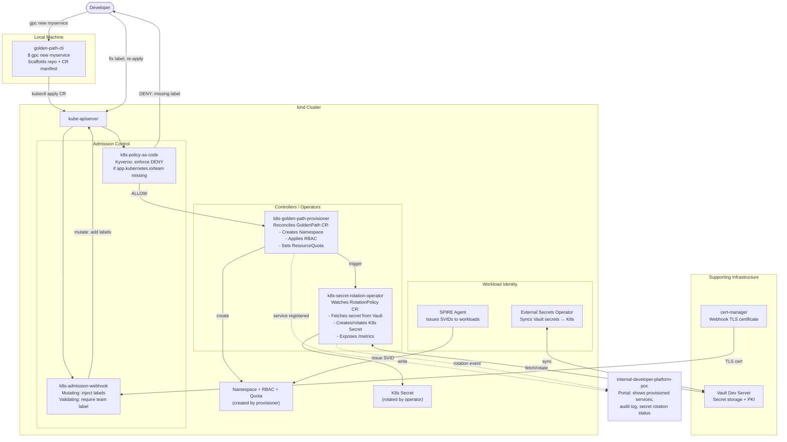

# Architecture — Secure Developer Platform
> Last updated: 2026-08-29 | Maturity: Full Prototype
> _End-to-end secure developer platform demonstrating scaffolding, admission control, policy enforcement, resource provisioning, and automated secret rotation._

## System Architecture

## Component Overview

| Component | Responsibility | Tech |
|---|---|---|
| `golden-path-cli` | CLI for scaffolding new services. | Go |
| `k8s-golden-path-provisioner` | Kubernetes controller for CRD reconciliation. | Go |
| `k8s-admission-webhook-from-scratch` | Mutating/validating webhook. | Go |
| `k8s-secret-rotation-operator` | Operator to rotate secrets via Vault. | Go |
| `k8s-policy-as-code` | Kyverno OPA policies. | YAML |
| `cloud-native-secrets-identity` | SPIFFE/SPIRE + ESO + Vault setup. | YAML/Go |
| `internal-developer-platform-poc` | IDP portal. | React/Node.js |
